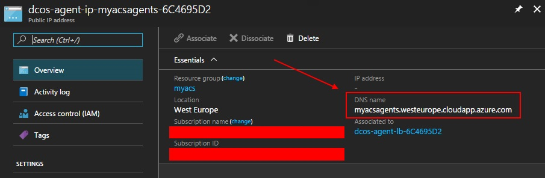

# programmez-vs2017-samples
*Morceaux de code accompagnant le dossier VS2017 du magazine Programmez*

La valeur du label **com.microsoft.acs.dcos.marathon.vhost** à mettre à jour est disponible directement sur le portail Azure : 

 

Ou encore via la commande `az acs list`, sur la propriété `agentPoolProfiles.fqdn` de l'Azure Container Service
